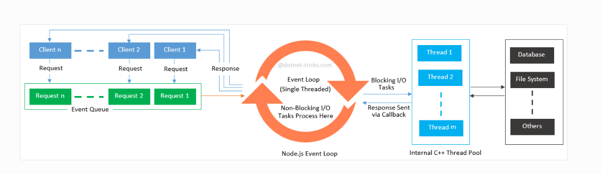

### NodeJS 👉

### Author Links:

👋 Hello, I'm Shrikrishna😎.

🚀 Folow Me:

- [GitHub](https://github.com/krishnakachare)
- [GitLab](https://gitlab.com/ShrikrishnaKachare)
- [LinkedIn](www.linkedin.com/in/shrikrishna-g-kachare-9a9411221)
- [Twitter](https://x.com/shrikrishnakach)

### NodeJs Syllabus:

- [NodeJs Syllabus](NodeJs_Syllabus/NodeJs_Syllabus.md)

- 🔗[JS Visualizer:](https://www.jsv9000.app/)

- 🔗[NodeJs Offitial Doc:](https://nodejs.org/docs/latest/api/)
- 🔗[NodeJs GitHub:](https://github.com/nodejs/node)

- 🔗[V8:](https://v8.dev/)
- 🔗[V8 Blog:](https://v8.dev/blog)
- 🔗[V8 GitHub:](https://github.com/v8/v8)

- 🔗[libuv:](https://docs.libuv.org/en/v1.x/)
- 🔗[libuv GitHub:](https://github.com/libuv/libuv)

- 🔗[ECMA:](https://ecma-international.org/publications-and-standards/standards/ecma-262/)
- 🔗[tc39:](https://tc39.es/ecma262/)

- 🔗[ASTExplorer:](https://astexplorer.net/)
  Abstract Syntax Tree

- 🔗[MongoDB Doc:](https://www.mongodb.com/docs/manual/tutorial/insert-documents/?interface=driver&language=nodejs)
- 🔗[MongoDB Compass:](https://www.mongodb.com/docs/compass/install/?operating-system=linux&package-type=.deb)
- 🔗[MongoDB package:](https://www.npmjs.com/package/mongodb)

  
